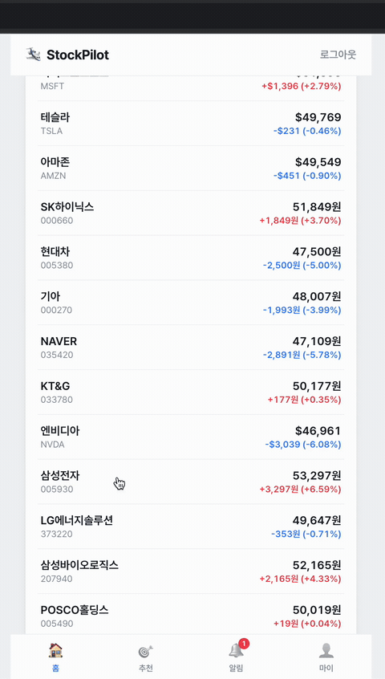
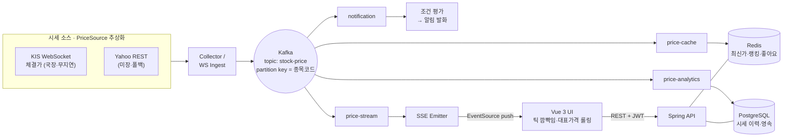

# StockPilot 🛩️

> **"당신의 투자를 조종하는 파일럿"** — 투자 성향 기반 개인 맞춤 주식 추천 플랫폼

투자 성향(위험 성향 · 투자 기간)에 맞춰 개인화된 종목을 추천하는 서비스.
단순 CRUD가 아니라 실무에서 쓰는 **메시지 브로커(Kafka) · 캐시(Redis) · 동시성 제어 ·
이벤트 기반 아키텍처 · 실시간 스트리밍 · 관측성**을 하나의 도메인 안에서 다루는 것을
목표로 한 **백엔드 중심 포트폴리오**다.


<p align="center">
  
</p>

> 종목 상세에서 **대표가격이 실시간 체결마다 카운트업 롤링**하는 모습(Kafka→SSE push).
> 백엔드 프로젝트라 라이브 URL 대신 녹화 데모 + 아키텍처 도식으로 증명한다.

---

## 기술 스택

| 영역 | 기술 |
|------|------|
| **Backend** | Java 17 · Spring Boot 3.5 · Spring Security + JWT · Spring Data JPA |
| **Messaging / Cache / DB** | Apache Kafka · Redis · PostgreSQL |
| **Realtime** | Server-Sent Events(SSE) · KIS WebSocket(체결가 H0STCNT0) |
| **Observability** | Actuator · Micrometer · Prometheus · Grafana |
| **Test / Infra** | JUnit 5 · Testcontainers(실 Postgres/Kafka) · H2 · Docker Compose |
| **Frontend** | Vue 3 · Vite · TypeScript · Pinia · Vue Router · axios |

---

## 아키텍처 개요

**하나의 시세 이벤트를 4개의 독립 Consumer group이 소비**한다 — 수집·저장·알림·스트리밍을 분리해
DB 병목 없이 확장한다.



- **레이어드**: Controller → Service → Repository, 도메인 단위 패키지(`com.arok2.stockpilot.*`).
- **이벤트 기반**: 실시간 시세는 Kafka로 비동기 수집·분산 소비(파티션 키=종목코드로 종목별 순차 보장).
- **Cache-Aside**: 조회 성능이 중요한 데이터는 Redis 우선, DB 폴백.

---

## 기술 실증 — "왜 이 기술을 썼나"

| 주제 | 문제 | 해법 (코드) |
|------|------|-------------|
| **Kafka** | 초당 유입되는 시세를 API가 직접 DB에 넣으면 병목 | 수집→Kafka→Consumer로 분리, 한 토픽을 **4개 group**(캐시/이력/알림/스트림)이 독립 소비 |
| **Redis ZSET** | 인기 랭킹을 `ORDER BY count DESC`로 매번 조회하면 느림 | Sorted Set `ZINCRBY`/`ZREVRANGE`로 O(logN) 랭킹 |
| **Redis Set** | 다수 동시 좋아요 시 lost update·중복 | `SADD` 멱등(1인 1좋아요) + `SCARD` 정확 집계, 배치로 DB 동기화 |
| **동시성 제어** | 다수 동시 관심등록 시 watch_count 갱신 손실 | DB 원자적 `UPDATE ... SET watch_count = watch_count + 1` + **Testcontainers 동시성 통합테스트로 갱신 손실 0 증명** |
| **Cache-Aside** | 추천 계산 비용 | Redis 캐시 우선·미스 시 계산 후 캐싱(TTL), 성향 변경 시 무효화, hit/miss 메트릭으로 적중률 관측 |
| **이벤트 드리븐** | 시세 조건 알림 | 시세 이벤트 소비 → 조건 평가 → 원자적 `ACTIVE→TRIGGERED`로 1회만 발화 |
| **SSE / WebSocket** | 폴링 지연 없이 실시간 반영 | Kafka `price-stream` group → SSE push, KIS WebSocket 체결가로 진짜 틱 스트리밍 |
| **관측성** | 아키텍처 효과를 수치로 증명 | Micrometer 커스텀 메트릭 → Prometheus → Grafana 대시보드 |

---

## 🧗 엔지니어링 도전 & 극복

실제로 부딪혀 해결한 문제들 (문제 → 원인 → 해결 → 결과).

### 1. KIS 실전 API 초당 제한을 WebSocket 승격으로 근본 해결
- **문제**: 한국투자증권 REST로 국내 다수 종목을 폴링하자 초당 거래건수 초과 에러(`EGW00201`) 지속 발생.
- **원인**: 쓰로틀(250→1200ms)·재시도를 붙여도 미해결. **단발 프로브는 통과하나 다수 종목 지속 폴링은 누적 감지에 걸림** → REST 폴링 자체가 다수 종목 실시간에 부적합, 재시도는 부하를 키우는 역효과임을 실측으로 규명.
- **해결**: 자바 단일 파일 프로브로 **WebSocket 체결가(H0STCNT0) wire 포맷(레코드당 46필드)을 실측·확정**한 뒤 폴링을 WS 구독으로 대체. 프래그먼트 누적·PINGPONG·자동 재연결 구현, 실측 프레임으로 파싱 단위테스트 작성.
- **결과**: rate 에러 **0건**, **지연 없는 틱 단위 실시간** 달성.

### 2. 실시간 수집기 프리즈 — 단일 스케줄러 스레드 블로킹 규명
- **문제**: 실행 하루 뒤 시세가 어제 값에 멈춤.
- **원인**: 외부 HTTP 클라이언트에 **타임아웃이 없어** 응답 없는 요청 하나가 단일 `@Scheduled` 스레드를 영구 블로킹 → 전체 수집 정지.
- **해결**: 연결/읽기 타임아웃 + 종목 단위 예외 격리(한 종목 실패가 전체를 막지 않도록).
- **배움**: "외부 HTTP는 반드시 타임아웃, 특히 단일 스레드 스케줄러" — 운영 견고성 원칙 체득.

### 3. 폴링 → 이벤트 push로 실시간 UX 전환
- **문제**: 프론트 폴링이라 시세가 화면에 즉시 반영되지 않음.
- **해결**: Kafka의 "하나의 이벤트, 다수 Consumer" 구조를 확장해 **SSE 전용 Consumer group** 추가 → 서버가 브라우저로 틱 push. UI에는 증권앱 관습(상승 빨강/하락 파랑) **깜빡임** + 대표가격 **롤링 애니메이션** 적용.
- **결과**: 폴링 제거, 체결 즉시 반영. (디버깅 중 "SSE 0틱" 오진은 백그라운드 curl 버퍼링 문제였고 엔드포인트는 정상 — **검증 방법 자체의 함정**을 로그로 규명.)

### 4. 인터페이스 추상화로 시세 소스 무중단 승격
- 시세 공급을 `PriceSource`로 추상화한 덕에 **랜덤 목 → 야후 → KIS 실시간** 승격이 **구현체 교체 + 프로퍼티 스위치만으로** 완료. Kafka·캐시·SSE·알림·추천 등 **나머지 파이프라인은 무변경** — 설계 의도(확장성)를 실제 승격으로 증명.

### 5. 실 인프라 없이 통과하는 테스트 전략
- 외부 의존이 많음에도 CI에서 인프라 없이 통과: **H2**(단위) + `@EmbeddedKafka` + Redis `@MockitoBean`, **동시성·인프라 의존은 Testcontainers(실 Postgres/Kafka)** 로 분리. 외부 API는 조회/파싱을 분리해 **실제 응답 샘플로 파싱 단위테스트**. → **테스트 132개 green**.

---

## 실시간 & 프론트엔드

- **시세 반영**: Kafka `price-stream` → SSE(`/api/stocks/stream`) → 프론트 `EventSource`. 목록은 **틱 깜빡임**, 상세 대표가격은 **카운트업 롤링**.
- **국장 실시간**: KIS WebSocket 체결가(무지연). **미장은 야후**(KIS 해외 실시간은 별도 신청) — 하이브리드.
- **프론트**: Vue 3 + Vite + TS. 홈(검색·시장 필터·장 세션 표시) / 상세(캔들차트·52주 게이지·종목정보·가격알림) / 추천(매칭 점수) / 알림 / 마이.

---

## 릴리스 히스토리

각 기능은 코드 + 테스트 + 실 인프라 라이브 검증 후 태그로 릴리스했다.

| 릴리스 | 기능 | 실증하는 것 |
|--------|------|-------------|
| v0.1.0 | 회원가입 | BCrypt, 유니크 제약 동시성 방어, 글로벌 예외 처리 |
| v0.2.0 | 로그인 / JWT | 무상태 인증, JWT 필터, 보호 자원 |
| v0.3.0 | 관심종목 등록/해제 | **동시성**: watch_count 원자적 UPDATE(갱신 손실 0) |
| v0.4.0 | Kafka 실시간 시세 수집 | 수집·저장 분리, 다중 Consumer 분산 소비 |
| v0.5.0 | 성향 기반 추천 | 가중치 스코어링 + **Cache-Aside**(Redis TTL) |
| v0.6.0 | 인기 랭킹 · 좋아요 | Redis **ZSET**(ZINCRBY/ZREVRANGE) · **Set**(SADD 멱등) |
| v0.7.0 | 이벤트 드리븐 알림 | 시세 이벤트 → 조건 평가, 원자적 발화(중복 방지) |
| v0.8.0 | 관측성 / 성능 | Micrometer 커스텀 메트릭 + Grafana 대시보드 |
| v0.9.0 | Yahoo 실 시세 연동 | `PriceSource` 교체만으로 목→실 데이터 전환 |
| **v1.0.0** | **Vue 프론트 + KIS 실시간 + SSE** | 실시간 UX(틱 깜빡임), KIS REST 하이브리드, 서버 push |
| **v1.1.0** | **상세 롤링 + KIS WebSocket 체결가** | 대표가격 롤링, WS 틱 스트리밍(초당 제한 완전 제거) |

---

## 주요 API

인증 필요 엔드포인트는 `Authorization: Bearer <accessToken>` 헤더를 요구한다.

| 도메인 | 메서드 · 경로 | 인증 |
|--------|--------------|:---:|
| 인증 | `POST /api/auth/signup` · `POST /api/auth/login` | 공개 |
| 사용자 | `GET /api/users/me` · `PATCH /api/users/me`(성향 변경) | 🔒 |
| 종목 | `GET /api/stocks`(목록·검색 `?q=`) · `GET /api/stocks/{code}` | 공개 |
| 시세 | `GET /api/stocks/{code}/chart` · `.../quote` · **`GET /api/stocks/stream`(SSE)** | 공개 |
| 관심종목 | `POST`·`DELETE /api/stocks/{id}/watch` · `GET /api/me/watchlist` | 🔒 |
| 추천 | `GET /api/recommendations` | 🔒 |
| 좋아요 | `POST`·`DELETE /api/stocks/{code}/like` · `GET /api/stocks/{code}/likes` | 🔒 / 공개 |
| 랭킹 | `POST /api/stocks/{code}/view` · `GET /api/rankings/popular` | 공개 |
| 알림 | `POST`·`GET /api/alerts` · `GET /api/notifications` | 🔒 |
| 메트릭 | `GET /actuator/prometheus` | 공개 |

---

## 실시간 시세 소스

`PriceSource` 인터페이스로 추상화되어 **구현체 교체만으로** 목↔실 데이터를 전환한다.
`stockpilot.price.source`(환경변수 `PRICE_SOURCE`)로 선택.

| 값 | 소스 | 비고 |
|----|------|------|
| `kis` | 한국투자증권(하이브리드) | **국장 실시간 무지연**, 미장은 야후. 앱키/OAuth 필요. `KIS_WEBSOCKET_ENABLED=true`면 국장 WS 체결가 스트리밍 |
| `yahoo` (기본) | Yahoo Finance | 국장 `.KS`/`.KQ`, 약 15분 지연, 키 불필요 |
| `random` | 랜덤워크 목 | 외부 의존 없음(오프라인/CI). 테스트는 항상 이 값 |

```bash
./gradlew bootRun                       # 기본: 야후 실 시세
PRICE_SOURCE=random ./gradlew bootRun    # 외부 의존 없이 목 시세

# KIS 실시간 — 앱키는 절대 커밋 금지, 환경변수로만 주입
KIS_APP_KEY=... KIS_APP_SECRET=... PRICE_SOURCE=kis ./gradlew bootRun
# WebSocket 체결가 스트림(권장)
KIS_APP_KEY=... KIS_APP_SECRET=... PRICE_SOURCE=kis KIS_WEBSOCKET_ENABLED=true ./gradlew bootRun
```

---

## 로컬 실행

```bash
# 1. 인프라 기동 (Postgres · Redis · Kafka · Kafka-UI · Prometheus · Grafana)
docker compose up -d

# 2. 백엔드
./gradlew bootRun

# 3. 프론트엔드
cd frontend && npm install && npm run dev   # http://localhost:5173

# 4. 테스트 (인프라 없이도 통과 — H2 프로파일 / 동시성은 Testcontainers)
./gradlew test
```

| 서비스 | 주소 |
|--------|------|
| App (API) | http://localhost:8080 |
| Frontend | http://localhost:5173 |
| Prometheus 메트릭 | http://localhost:8080/actuator/prometheus |
| Kafka UI | http://localhost:8081 |
| Prometheus | http://localhost:9090 |
| Grafana | http://localhost:3000 (admin/admin) — "StockPilot 관측성" 대시보드 자동 프로비저닝 |

---

## AI 개발 파이프라인 (GitHub Actions)

이 저장소는 GitHub Issue 하나를 자동으로 PR로 전환하는 **자가치유(self-healing) 5-에이전트
파이프라인**을 사용한다. 모든 단계는 **이슈 라벨**로 트리거되며, Reviewer가 반려하면 Fix
에이전트가 스스로 패치를 시도(최대 3회)한 뒤 초과 시 사람에게 넘긴다.

```
Issue +plan ─▶ Planner ─(design)▶ Architect ─(implement)▶ Implementer ─▶ PR + review 라벨
                                                                              │
   ┌──────────────────────────────────────────────────────────────────────   ▼
   │  Reviewer  ①빌드·테스트 게이트(./gradlew test)  →  ②통과 시에만 Claude 리뷰
   │      ├─ APPROVED  → develop 자동 병합 + done
   │      └─ REJECTED  → Fix 자가치유(리뷰/빌드 로그로 패치 → retry) → 3회 초과 시 사람 인계
```

- 트리거는 전부 **이슈 라벨**(`plan`→`design`→`implement`→`review`). 라벨 권한(triage 이상)이 곧 접근제어.
- 각 에이전트는 `.claude/agents/*.md` 프롬프트로 Claude API를 호출하고, 산출물을 오케스트레이션 서버에 등록한다.
- **신뢰성 장치**: (1) Claude 리뷰 전 CI에서 실제 `./gradlew test`로 컴파일·회귀 선차단, (2) 기존 소스 목록 + 핵심 연동 파일을 프롬프트에 주입해 기존 코드 보존.

> 프론트엔드는 실시간 UX 반복이 잦아 파이프라인 대신 직접 구현했다. 세부 배경은 커밋 히스토리 참고.

---

## 문서

- 제품 비전 · 로드맵: [`docs/product/`](docs/product/)
- 아키텍처: [`docs/architecture/architecture.md`](docs/architecture/architecture.md)
- KIS 실시간 승격: [`docs/kis-integration.md`](docs/kis-integration.md)
- 프론트 단계별 기록: [`docs/frontend/`](docs/frontend/)
