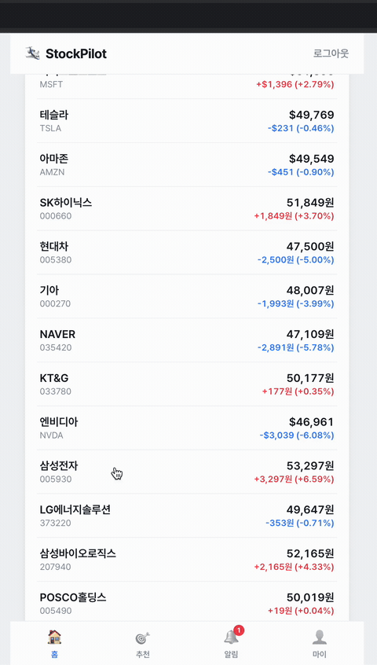
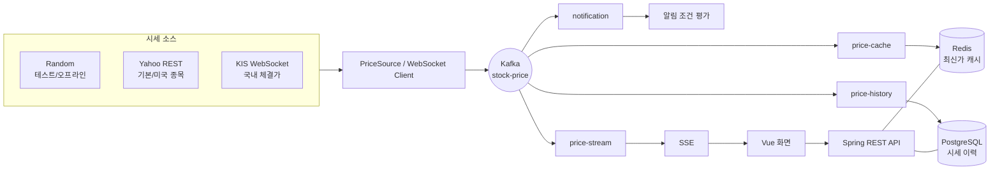

# StockPilot

외부 시세 API의 호출 제한을 겪으며 REST 폴링 구조의 한계를 확인하고, WebSocket 수집과 Kafka 기반 처리 흐름으로 전환한 실시간 데이터 처리 학습 프로젝트입니다.


<p align="center">
  
</p>

> 종목 상세 화면에서 Kafka로 들어온 시세 이벤트가 SSE를 통해 브라우저에 전달되고, 대표 가격이 갱신되는 흐름을 녹화한 데모입니다.

---

## 프로젝트 배경

처음 목표는 투자 성향과 투자 기간에 맞춰 종목을 추천하는 백엔드 서비스를 만드는 것이었습니다. 구현을 진행하면서 단순 추천 API보다 먼저 풀어야 할 문제가 보였습니다. 추천, 알림, 랭킹은 모두 신뢰할 수 있는 시세 흐름 위에서 동작해야 하는데, 외부 시세 API를 REST로 반복 호출하는 방식은 다수 종목을 실시간에 가깝게 다루기 어렵다는 점이었습니다.

그래서 이 프로젝트의 중심을 "주식 추천 서비스"에서 한 단계 더 좁혀, 외부 API의 제약을 실제로 마주하고 수집 구조를 바꿔 보는 실시간 데이터 처리 프로젝트로 잡았습니다.

핵심 질문은 다음과 같았습니다.

- REST 폴링으로 여러 종목의 현재가를 계속 가져오면 어떤 한계가 생기는가?
- WebSocket 체결가 수신으로 전환하면 수집 구조와 검증 방식은 어떻게 달라지는가?
- Kafka, Redis, SSE는 각각 어디까지 책임지는 것이 적절한가?
- 외부 API, 메시지 브로커, 캐시가 얽힌 흐름을 로컬 테스트와 실행 로그로 어떻게 확인할 수 있는가?

---

## 문제와 전환 과정

### 1. REST 폴링의 한계 확인

초기에는 `PriceSource` 구현체를 통해 Yahoo Finance와 KIS REST API에서 시세를 가져왔습니다. Yahoo는 별도 키 없이 사용할 수 있었지만 국내 종목은 지연 시세에 가깝고, KIS REST는 국내 현재가를 더 직접적으로 확인할 수 있었습니다.

문제는 국내 여러 종목을 지속 폴링할 때 발생했습니다. KIS REST API에서 초당 거래건수 초과 오류(`EGW00201`)가 반복되었고, 호출 간격을 늘리거나 재시도를 추가해도 다수 종목을 계속 조회하는 상황에서는 안정적이지 않았습니다. 단발성 호출은 통과하지만, 여러 종목을 반복적으로 조회하면 누적 호출 패턴이 제한에 걸리는 것으로 확인했습니다.

이 경험으로 REST 폴링은 "가끔 조회하는 현재가 API"에는 적합해도, 여러 종목을 지속적으로 갱신하는 실시간 수집 구조에는 맞지 않는다고 판단했습니다.

### 2. WebSocket 수집으로 전환

KIS WebSocket 체결가(`H0STCNT0`)를 직접 연결해 실제 수신 프레임을 확인했습니다. 체결 메시지는 `^` 구분 필드로 구성되어 있었고, 실측 프레임을 기준으로 종목코드, 현재가, 전일대비, 누적거래량을 파싱했습니다.

WebSocket 클라이언트에는 다음 처리를 넣었습니다.

- 체결가 메시지 파싱 및 Kafka `stock-price` 토픽 발행
- 프래그먼트 메시지 누적 처리
- PINGPONG 응답 처리
- 연결 종료 시 재연결
- WebSocket이 국내 종목을 처리할 때 REST 스케줄러의 국내 폴링 생략

이후 테스트 구간에서 REST API rate limit 없이 WebSocket 체결가 수신을 확인했고, 수집된 이벤트가 Kafka, Redis 캐시, SSE 전달 흐름으로 이어지는지 실행 로그와 화면 갱신으로 검증했습니다. 다만 이 결과는 테스트한 종목 수와 실행 환경 안에서의 확인이며, 모든 시장 상황에서의 처리량을 보장한다는 의미는 아닙니다.

### 3. 인터페이스 추상화로 외부 시세 소스 교체

시세 공급원은 `PriceSource` 인터페이스로 분리했습니다. 덕분에 랜덤 목 데이터, Yahoo REST, KIS REST/WebSocket을 같은 파이프라인 앞단에 연결할 수 있었습니다.

```java
public interface PriceSource {
    StockPriceEvent fetch(Stock stock);
}
```

시세 소스가 바뀌어도 Kafka 이후의 캐시, 이력 저장, 알림, SSE 전달 흐름은 그대로 유지했습니다. 이 구조 덕분에 외부 API를 바꾸는 작업이 서비스 전체 수정으로 번지지 않았고, 구현체 교체와 설정값 변경만으로 수집 방식을 단계적으로 바꿀 수 있었습니다.

---

## 처리 흐름


```mermaid
flowchart LR
    subgraph SRC["시세 소스"]
        RW["Random<br/>테스트/오프라인"]
        YH["Yahoo REST<br/>기본/미국 종목"]
        KIS["KIS WebSocket<br/>국내 체결가"]
    end

    SRC --> ING["PriceSource / WebSocket Client"]
    ING --> K(("Kafka<br/>stock-price"))
    K --> C1["price-cache"] --> R[("Redis<br/>최신가 캐시")]
    K --> C2["price-history"] --> PG[("PostgreSQL<br/>시세 이력")]
    K --> C3["notification"] --> N["알림 조건 평가"]
    K --> C4["price-stream"] --> SSE["SSE"]
    SSE --> WEB["Vue 화면"]

    WEB --> API["Spring REST API"]
    API --- R
    API --- PG
```

각 구성 요소의 책임은 다음처럼 나눴습니다.

| 구성 요소 | 맡은 책임 |
|-----------|-----------|
| `PriceSource` | 외부 시세 공급원 교체 지점. Random, Yahoo, KIS 구현체를 분리 |
| KIS WebSocket | 국내 종목 체결가 수신. REST 폴링으로 감당하기 어려운 실시간 입력 처리 |
| Kafka | 시세 이벤트를 한 번 발행하고 캐시, 이력, 알림, 스트리밍 소비자가 독립적으로 처리 |
| Redis | 최신가 캐시, 추천 결과 캐시, 인기 랭킹, 좋아요 멱등 처리 |
| PostgreSQL | 사용자, 종목, 관심종목, 시세 이력, 알림 데이터 영속화 |
| SSE | 서버에서 브라우저로 시세 변경 이벤트 전달 |
| Vue | 종목 목록, 상세, 추천, 알림 화면에서 API와 SSE 흐름 확인 |

---

## 주요 기능

- 회원가입, 로그인, JWT 인증
- 투자 성향 기반 종목 추천
- 관심종목 등록/해제 및 watch count 갱신
- 최신가 조회, 차트 데이터 조회, SSE 시세 스트림
- Redis Sorted Set 기반 인기 랭킹
- Redis Set 기반 좋아요 멱등 처리
- 가격 조건 알림 등록 및 시세 이벤트 기반 조건 평가
- Actuator, Prometheus, Grafana를 통한 JVM/HTTP/Kafka 메트릭 노출 및 수집 확인

---

## 검증 방법

외부 API와 인프라에 의존하는 프로젝트라, "실제로 연결했을 때의 로그"와 "로컬에서 반복 가능한 테스트"를 나눠 확인했습니다.

| 검증 대상 | 확인 방법 |
|-----------|-----------|
| KIS WebSocket 파싱 | 실제 수신 프레임 샘플을 기준으로 체결가 필드 파싱 단위 테스트 작성 |
| Kafka 흐름 | `@EmbeddedKafka` 기반 round-trip 테스트로 발행/소비 경로 확인 |
| Redis 의존 로직 | 테스트에서는 Redis를 mock 처리하고, 캐시/랭킹/좋아요 로직을 서비스 단위로 검증 |
| 관심종목 동시성 | Testcontainers PostgreSQL에서 다중 스레드 등록/해제 시 카운트 정합성 확인 |
| 외부 HTTP 안정성 | Yahoo/KIS REST 호출에 연결/읽기 타임아웃을 적용하고 종목 단위 예외 격리 |
| 관측성 | 로컬 실행 기준 `/actuator/prometheus` 노출, Prometheus scrape, Grafana 대시보드 프로비저닝 확인 |
| 프론트 실시간 반영 | Kafka 이벤트가 SSE로 전달되어 상세 화면의 가격 표시가 갱신되는지 실행 화면으로 확인 |

현재 테스트는 로컬 인프라 없이도 기본적으로 통과하도록 구성했습니다. H2, `@EmbeddedKafka`, mock Redis를 사용하고, Docker가 있는 환경에서는 PostgreSQL Testcontainers 기반 동시성 테스트가 함께 실행됩니다.

---

## Observability

로컬에서 `docker compose up -d`와 `PRICE_SOURCE=random ./gradlew bootRun`으로 실행한 뒤 관측성 연결을 확인했습니다.

확인한 범위는 다음과 같습니다.

- `http://localhost:8080/actuator/prometheus`에서 Prometheus 포맷 메트릭이 `200 OK`로 노출됨
- Prometheus `up` 쿼리에서 `stock-pilot (host.docker.internal:8080)` target이 `1`로 수집됨
- Prometheus query API로 `jvm_memory_used_bytes`, `http_server_requests_seconds_count`, `kafka_consumer_fetch_manager_records_consumed_total` 수집 여부 확인
- Grafana에 `StockPilot 관측성` 대시보드가 프로비저닝되고, target up/JVM/HTTP/Kafka consumer 패널이 Prometheus 데이터를 조회하는 것 확인

대시보드 산출물:

- Grafana export: [`docs/observability/grafana-dashboard.json`](docs/observability/grafana-dashboard.json)
- 로컬 확인 캡처: [`docs/assets/grafana-dashboard.jpg`](docs/assets/grafana-dashboard.jpg)
- 원본 프로비저닝 파일: [`monitoring/grafana/dashboards/stockpilot.json`](monitoring/grafana/dashboards/stockpilot.json)

추천 캐시 hit/miss, 좋아요, 조회수, 알림 발화 같은 커스텀 비즈니스 메트릭은 관련 API 요청이 발생해야 값이 채워집니다. 이번 확인에서는 메트릭 노출과 수집 가능 여부, JVM/HTTP/Kafka consumer 메트릭 수집, Grafana 대시보드 로딩을 확인했습니다.

---

## 기술 스택

| 영역 | 기술 |
|------|------|
| Backend | Java 17, Spring Boot 3.5, Spring Security, JWT, Spring Data JPA |
| Messaging / Cache | Apache Kafka, Redis |
| Database | PostgreSQL, H2(test) |
| Realtime | KIS WebSocket, Server-Sent Events(SSE) |
| Observability | Spring Boot Actuator, Micrometer, Prometheus scrape config, Grafana provisioning/dashboard JSON |
| Test / Infra | JUnit 5, `@EmbeddedKafka`, Testcontainers, Docker Compose |
| Frontend | Vue 3, Vite, TypeScript, Pinia, Vue Router, axios |

---

## 실행 방법

```bash
# 1. 인프라 기동
docker compose up -d

# 2. 백엔드 실행
./gradlew bootRun

# 3. 프론트엔드 실행
cd frontend
npm install
npm run dev

# 4. 테스트
./gradlew test
```

| 서비스 | 주소 |
|--------|------|
| API | http://localhost:8080 |
| Frontend | http://localhost:5173 |
| Prometheus 메트릭 | http://localhost:8080/actuator/prometheus |
| Kafka UI | http://localhost:8081 |
| Prometheus | http://localhost:9090 (`up`, `jvm_memory_used_bytes`, `http_server_requests_seconds_count` 등 확인) |
| Grafana | http://localhost:3000 (`admin`/`admin`, `StockPilot 관측성` 대시보드 자동 로딩) |

---

## 시세 소스 설정

`stockpilot.price.source` 또는 환경변수 `PRICE_SOURCE`로 시세 소스를 선택합니다.

| 값 | 설명 |
|----|------|
| `random` | 외부 API 없이 동작하는 목 시세. 테스트와 오프라인 실행에 사용 |
| `yahoo` | Yahoo Finance REST 기반 시세 조회. 기본값 |
| `kis` | KIS 기반 시세 조회. `KIS_WEBSOCKET_ENABLED=true`이면 국내 종목은 WebSocket 체결가를 사용 |

```bash
# 외부 의존 없이 실행
PRICE_SOURCE=random ./gradlew bootRun

# Yahoo REST 사용
PRICE_SOURCE=yahoo ./gradlew bootRun

# KIS WebSocket 사용
KIS_APP_KEY=... \
KIS_APP_SECRET=... \
PRICE_SOURCE=kis \
KIS_WEBSOCKET_ENABLED=true \
./gradlew bootRun
```

KIS 앱키와 시크릿은 코드나 설정 파일에 직접 저장하지 않고 환경변수로만 주입합니다.

---

## 주요 API

인증이 필요한 엔드포인트는 `Authorization: Bearer <accessToken>` 헤더를 사용합니다.

| 도메인 | 메서드 · 경로 | 인증 |
|--------|--------------|:---:|
| 인증 | `POST /api/auth/signup`, `POST /api/auth/login` | 공개 |
| 사용자 | `GET /api/users/me`, `PATCH /api/users/me` | 필요 |
| 종목 | `GET /api/stocks`, `GET /api/stocks/{code}` | 공개 |
| 시세 | `GET /api/stocks/{code}/chart`, `GET /api/stocks/{code}/quote`, `GET /api/stocks/stream` | 공개 |
| 관심종목 | `POST /api/stocks/{id}/watch`, `DELETE /api/stocks/{id}/watch`, `GET /api/me/watchlist` | 필요 |
| 추천 | `GET /api/recommendations` | 필요 |
| 좋아요 | `POST /api/stocks/{code}/like`, `DELETE /api/stocks/{code}/like`, `GET /api/stocks/{code}/likes` | 일부 필요 |
| 랭킹 | `POST /api/stocks/{code}/view`, `GET /api/rankings/popular` | 공개 |
| 알림 | `POST /api/alerts`, `GET /api/alerts`, `GET /api/notifications` | 필요 |
| 메트릭 | `GET /actuator/prometheus` | 공개 |

---

## 릴리스 요약

| 릴리스 | 주요 변화 |
|--------|-----------|
| v0.1.0 ~ v0.3.0 | 회원가입, 로그인/JWT, 관심종목 등록과 동시성 처리 |
| v0.4.0 ~ v0.7.0 | Kafka 시세 수집, Redis 추천 캐시, 랭킹/좋아요, 이벤트 기반 알림 |
| v0.8.0 ~ v0.9.0 | Prometheus/Grafana 관측성, Yahoo 시세 연동 |
| v1.0.0 | Vue 프론트엔드, KIS REST 연동, SSE 기반 화면 갱신 |
| v1.1.0 | KIS WebSocket 체결가 수신 추가, REST 폴링 중심 구조 보완 |
| v1.2.0 | 도메인 패키지 정리, Command 분리, Testcontainers PostgreSQL 동시성 검증 |

---

## AI 도구 사용 범위

AI 도구는 개발 과정에서 보조 수단으로 사용했습니다.

- 코드 초안 작성, 테스트 케이스 아이디어 정리, README와 개발 문서 초안 작성에 활용했습니다.
- 외부 API 호출 제한 분석, WebSocket 전환 판단, Kafka/Redis/SSE 책임 분리, 검증 기준은 직접 정의했습니다.
- AI가 제안한 코드는 테스트 실행, 실행 로그 확인, 실제 API 응답 샘플 기반 파싱 검증을 거친 뒤 반영했습니다.

---

## AI 개발 파이프라인

일부 백엔드 작업은 개인 프로젝트인 `dev-agent`에서 만든 GitHub Issue 기반 AI 개발 파이프라인을 실험적으로 사용했습니다. Issue 라벨로 계획, 설계, 구현, 리뷰 단계를 나누고, CI 테스트를 통과한 변경만 리뷰 대상으로 넘기는 방식입니다.

다만 StockPilot의 핵심 의사결정은 외부 API 한계 분석, WebSocket 전환, 이벤트 처리 구조 설계, 테스트 기준 수립에 있으며, AI 파이프라인은 반복 구현과 문서화 보조에 한정해 사용했습니다. 자세한 파이프라인 설명은 `dev-agent` 프로젝트 README에서 다룹니다.

---

## 문서

- 제품 비전과 로드맵: [`docs/product/`](docs/product/)
- 아키텍처 기준: [`docs/architecture/architecture.md`](docs/architecture/architecture.md)
- KIS 연동 기록: [`docs/kis-integration.md`](docs/kis-integration.md)
- 관측성 대시보드 export: [`docs/observability/grafana-dashboard.json`](docs/observability/grafana-dashboard.json)
- 프론트엔드 단계별 기록: [`docs/frontend/`](docs/frontend/)
